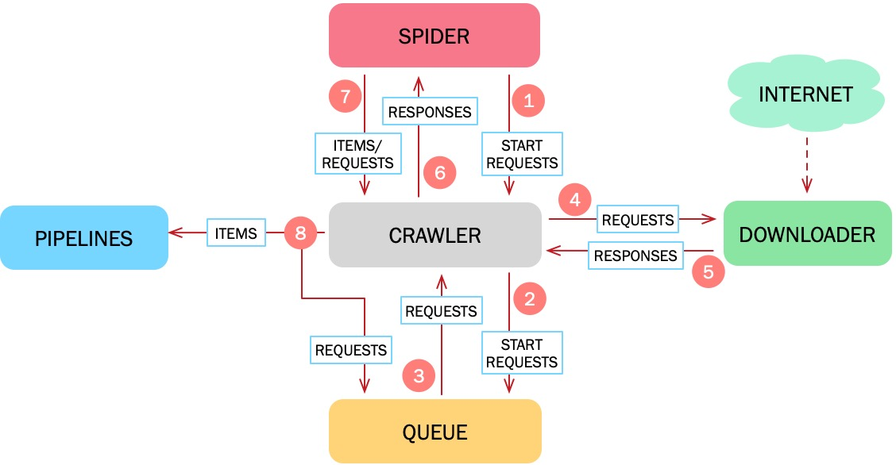

.. _architecture:

Architecture Overview
=====================

这里我们会对xpaw的结构进行简要的介绍。

首先我们会给出爬虫运行过程中的数据流图，接着我们会对数据流中呈现的各个组件进行简要的介绍。

Data Flow
---------

数据流以cluster为核心，并由cluster进行控制和驱动：

1. cluster从spider中获取初始请求 :class:`~xpaw.http.HttpRequest` 。
2. cluster将得到 :class:`~xpaw.http.HttpRequest` 放入到queue中。
3. cluster不停地从queue中获取待处理的 :class:`~xpaw.http.HttpRequest` 。
4. cluster将 :class:`~xpaw.http.HttpRequest` 交由downloader处理。
5. downloader完成下载后生成 :class:`~xpaw.http.HttpResponse` 返回给cluster。
6. cluster将得到的 :class:`~xpaw.http.HttpResponse` 交由spider处理。
7. spider处理 :class:`~xpaw.http.HttpResponse` 并提取数据 :class:`~xpaw.item.Item` 和新的请求 :class:`~xpaw.http.HttpRequest` 。
8. cluster将得到的 :class:`~xpaw.item.Item` 交由pipeline处理，将得到的 :class:`~xpaw.http.HttpRequest` 放入到queue中。

爬虫会持续运行直到所有生成的requests都被处理完且不再生成新的requests为止。

Components
----------

Cluster
^^^^^^^

实现对各个组件的控制和驱动。

Queue
^^^^^

存储 :class:`~xpaw.http.HttpRequest` 的队列。

Downloader
^^^^^^^^^^

基于协程实现异步下载功能。

Spider
^^^^^^

用户在 :class:`~xpaw.spider.Spider` 中实现采集任务的核心逻辑，包括网页解析、数据抽取、链接抽取等。

Pipeline
^^^^^^^^

处理采集得到的结构化数据。
