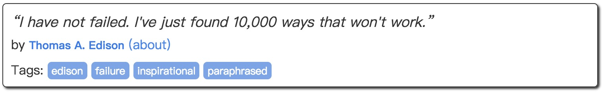

.. include:: <isonum.txt>

.. _tutorial1:

Tutorial I: First Spider
========================

在这个tutorial中，我们的爬取目标为: `quotes.toscrape.com <http://quotes.toscrape.com/>`_ ，在此特别感谢 `scrapinghub <https://scrapinghub.com>`_ 提供了这个测试爬虫的网站。

我们的需求为爬取网站中所有的quotes并以json的形式保存下来，每个quote包含如下几个字段:

============  ======================
名称            含义
============  ======================
text           quote的内容
author         quote作者
author_url     作者的相关链接
tags           quote的标签列表
============  ======================

例如对于这个quote:

我们得到的json数据为::

    {
        "text": "“I have not failed. I've just found 10,000 ways that won't work.”",
        "author": "Thomas A. Edison",
        "author_url": "http://quotes.toscrape.com/author/Thomas-A-Edison",
        "tags": ["edison", "failure", "inspirational", "paraphrased"]
    }

Spider Overview
---------------

我们编写的spider需要继承 ``xpaw.Spider`` 类，需要实现的功能包括:

- 生成初始入口链接
- 从爬取的网页中提取出所需的数据和后续待爬取的链接

我们首先给出spider的完整代码，然后再逐一进行解释：

.. code-block:: python

    from urllib.parse import urljoin
    import json

    from xpaw import Spider, HttpRequest, Selector, run_spider

    class QuotesSpider(Spider):
        quotes = []

        def start_requests(self):
            yield HttpRequest('http://quotes.toscrape.com/', callback=self.parse)

        def parse(self, response):
            selector = Selector(response.text)
            for quote in selector.css('div.quote'):
                text = quote.css('span.text')[0].text
                author = quote.css('small.author')[0].text
                author_url = quote.css('small+a')[0].attr('href')
                author_url = urljoin(str(response.url), author_url)
                tags = quote.css('div.tags a').text
                self.quotes.append(dict(text=text, tags=tags,
                                        author=author, author_url=author_url))
            next_page = selector.css('li.next a')
            if len(next_page) > 0:
                next_page_url = urljoin(str(response.url), next_page[0].attr('href'))
                yield HttpRequest(next_page_url, callback=self.parse)

        def close(self):
            with open('quotes.json', 'w') as f:
                json.dump(self.quotes, f, ensure_ascii=False, indent=4)

    if __name__ == '__main__':
        run_spider(QuotesSpider, log_level='DEBUG')

Start Requests
--------------

xpaw在加载spider后会调用其 ``start_requests`` 函数来获取整个爬取过程的入口链接，我们需要在该函数中生成入口链接并用HttpRequest进行封装。
在这个任务中，我们从网站首页开始即可遍历所有quotes所在的网页，因此入口链接选择网站的首页即可。

.. code-block:: python

    def start_requests(self):
        yield HttpRequest('http://quotes.toscrape.com/', callback=self.parse)

.. note::
    ``start_requests`` 函数的返回值需为可迭代对象，如tuple, list, generator等。

HttpRequest的 ``callback`` 用来指定该request对应的response由哪个函数来处理。

.. note::
    ``callback`` 只能指定为spider自身的成员函数。

Data & Links
------------

xpaw成功获取到response之后，会调用在request中指定的 ``callback`` 函数来处理response，如果没有指定则会默认调用spider中名为 ``parse`` 的函数，这时如果没有定义 ``parse`` 函数，则会抛出异常。
在这个任务中，我们在 ``parse`` 函数中提取出quote的各项属性和翻页链接。

.. note::
    - spider中处理response的函数的返回值需为可迭代对象，如tuple, list, generator等。
    - 在提取链接时我们不需要关注提取出URL是否重复了，xpaw会自动帮我们完成URL去重的工作。

HTML Features of Data
^^^^^^^^^^^^^^^^^^^^^

首先我们关注如何提取网页中的quote。

通过查看网页的源代码，我们发现每个quote是用类似如下的HTML代码进行描述的：

.. code-block:: html

    

        “I have not failed.
        I&#39;ve just found 10,000 ways that won&#39;t work.”
        by <small class="author" itemprop="author">Thomas A. Edison</small>
        <a href="/author/Thomas-A-Edison">(about)</a>
        
        

            Tags:
            <a class="tag" href="/tag/edison/page/1/">edison</a>
            <a class="tag" href="/tag/failure/page/1/">failure</a>
            <a class="tag" href="/tag/inspirational/page/1/">inspirational</a>
            <a class="tag" href="/tag/paraphrased/page/1/">paraphrased</a>
        

    

我们可以发现每个quote都是位于一个 ``class=quote`` 的 ``
`` 标签中，以及quote的各项属性 (text, author, author_url, tags) 所在节点的特征:

- **text** : 位于 ``class=text`` 的 ```` 标签中
- **author** : 位于 ``class=author`` 的 ``<small>`` 标签中
- **author_url** : ``<small>`` 标签紧邻的 ``<a>`` 标签的 ``href`` 属性
- **tags** : 所有 ``class=tag`` 的 ``<a>`` 标签中

HTML Features of Links
^^^^^^^^^^^^^^^^^^^^^^

接下来我们关注如何提取网页中的链接。

同样的，通过查看网页原代码，我们看到 "Next |rarr|" 附近的HTML代码:

.. code-block:: html

    <nav>
        <ul class="pager">
            <li class="previous">
                <a href="/page/1/">&larr; Previous</a>
            </li>
            <li class="next">
                <a href="/page/3/">Next &rarr;</a>
            </li>
        </ul>
    </nav>

我们发现翻页 "Next |rarr|" 的对应着 ``class=next`` 的 ``<li>`` 标签中的 ``<a>`` 标签的 ``href`` 属性。

Extracting Data & Links
^^^^^^^^^^^^^^^^^^^^^^^

在得到了数据以及链接相关的HTML特征之后，我们将特征用CSS Selector语法对其描述，并借助 :class:`~xpaw.selector.Selector` 提取quote和翻页的链接:

.. code-block:: python

    def parse(self, response):
        selector = Selector(response.text)
        for quote in selector.css('div.quote'):
            text = quote.css('span.text')[0].text
            author = quote.css('small.author')[0].text
            author_url = quote.css('small+a')[0].attr('href')
            author_url = urljoin(str(response.url), author_url)
            tags = quote.css('div.tags a').text
            self.quotes.append(dict(text=text, tags=tags,
                                    author=author, author_url=author_url))
        next_page = selector.css('li.next a')
        if len(next_page) > 0:
            next_page_url = urljoin(str(response.url), next_page[0].attr('href'))
            yield HttpRequest(next_page_url, callback=self.parse)

有关CSS Selector语法的详细信息，可以参考 `CSS Selector Reference <http://w3schools.bootcss.com/cssref/css_selectors.html>`_ 。

我们也可以通过XPath语法来提取所需数据。
更多有关 :class:`~xpaw.selector.Selector` 的使用方法，请参考 :ref:`selector` 章节。

Storing Data
------------

在这个任务中，我们在spider的 ``close`` 函数中完整了数据的保存。
当爬取工作完成后，xpaw会调用spider的 ``close`` 函数 (如果存在的话)，因此我们借机在该函数中将所有爬取到的quotes以json的格式写入到文件中。

.. code-block:: python

    def close(self):
        with open('quotes.json', 'w') as f:
            json.dump(self.quotes, f, ensure_ascii=False, indent=4)

Running Spider
--------------

我们通过xpaw内置的 ``run_spider`` 函数来运行spider，函数的第一个参数为spider类，相关配置可以通过关键词参数的形式进行设置。
例如这里我们通过 ``log_level='DEBUG'`` 设定日志的级别为 ``DEBUG`` 。
具体的配置项可参考 :ref:`settings` 。

.. code-block:: python

    if __name__ == '__main__':
        run_spider(QuotesSpider, log_level='DEBUG')

运行我们的spider后会在同级目录下生成了quotes.json文件，打开即可看到爬取的quotes数据。
